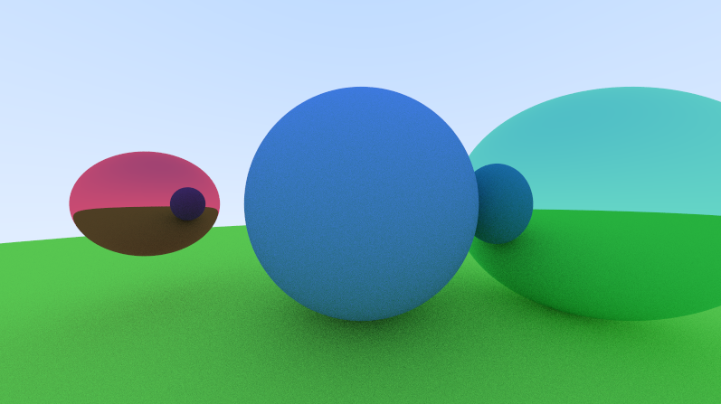

# ray_Tracing
Projeto de estudos na área de computação gráfica com C++, buscando compreender o funcionamento de um ray tracer. Material baseado na série de livros "[Ray Tracing in One Weekend](https://raytracing.github.io/)".

Estágio atual: adicionando outros objetos hitáveis ao render. 

Render atual: 

 .
    

